# Orders Orchestrator

Event-sourced order ingestion and orchestration service built with NestJS, PostgreSQL, Redis, and BullMQ. It ingests Shopify webhooks, persists immutable events, drives stateful order updates, and triggers downstream booking/notification flows via queues.

## High-level flow

- Shopify webhook → `ShopifyWebhookService` maps payloads to internal events.
- Events are stored in `event_store`, then the event id is pushed to `SHOPIFY_EVENTS` queue.
- Workers pull from queues to update the `orders` table with locking (`SELECT ... FOR UPDATE`) and idempotent state checks.
- When an order becomes bookable, a booking request is published to `INTERNAL_BOOKING_EVENTS`; courier updates flow through `COURIER_EVENTS`; Shopify admin notifications flow through `SHOPIFY_ADMIN_NOTIFICATIONS`.
- Rate limiting and default retries are applied at the worker/queue level (config-driven).

## Getting started

```bash
yarn install
docker compose up -d postgres redis
```

Create `.env` (see `.env-example`) with DB, Redis, and service URLs. Important keys:

- DB: `DB_CONNECTION`, `DB_HOST`, `DB_PORT`, `DB_USERNAME`, `DB_PASSWORD`, `DB_DATABASE`, `DB_SSL_CA` (optional)
- Queue/worker: `QUEUE_DEFAULT_ATTEMPTS` (default 3), `QUEUE_DEFAULT_BACKOFF_MS` (default 5000), `QUEUE_DEFAULT_BACKOFF_TYPE` (`fixed|exponential`, default exponential)
- Shopify admin notifications rate limit: `SHOPIFY_ADMIN_NOTIFICATIONS_RATE_MAX` (default 2), `SHOPIFY_ADMIN_NOTIFICATIONS_RATE_DURATION_MS` (default 1000)

Run the app:

```bash
yarn start:dev
```

## Chaos test (Shopify)

Stress the webhook ingestion with out-of-order, duplicate, and conflicting events.

```bash
npm run chaos-test-order-events
# or: yarn chaos-test-order-events
# or: npx ts-node scripts/choas-test/chaos-shopify.ts
```

Targets `http://localhost:4000/webhooks/shopify` and randomizes create/update/cancel/paid events for a single order id. Inspect `event_store`, queues, and `orders` afterward.

## Database schema

See `docs/db-schema.md` (mermaid ERD) for `event_store` and `orders` tables and their relationship.

## Shopify webhook flow

Sequence from HTTP webhook to DB and queues:



Source diagram and mermaid text: `docs/shopify-webhook-to-order-flow.md`.

## Key scripts

- Start services: `docker compose up -d postgres redis`
- Run app: `yarn start:dev`
- Chaos test: `ts-node scripts/choas-test/chaos-shopify.ts`
