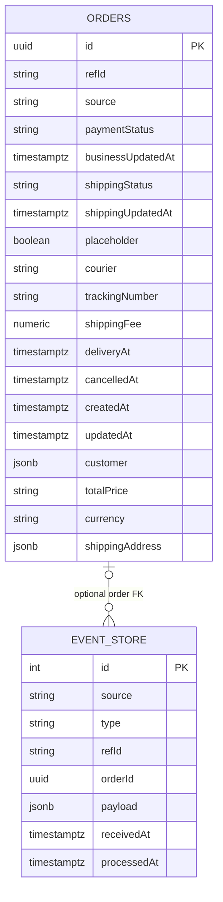

# Database Schema (ER Diagram)

```mermaid
erDiagram
  EVENT_STORE {
    int id PK
    string source
    string type
    string refId
    uuid orderId
    jsonb payload
    timestamptz receivedAt
    timestamptz processedAt
  }

  ORDERS {
    uuid id PK
    string refId
    string source
    string paymentStatus
    timestamptz businessUpdatedAt
    string shippingStatus
    timestamptz shippingUpdatedAt
    boolean placeholder
    string courier
    string trackingNumber
    numeric shippingFee
    timestamptz deliveryAt
    timestamptz cancelledAt
    timestamptz createdAt
    timestamptz updatedAt
    jsonb customer
    string totalPrice
    string currency
    jsonb shippingAddress
  }

  ORDERS |o--o{ EVENT_STORE : "optional order FK"
```
