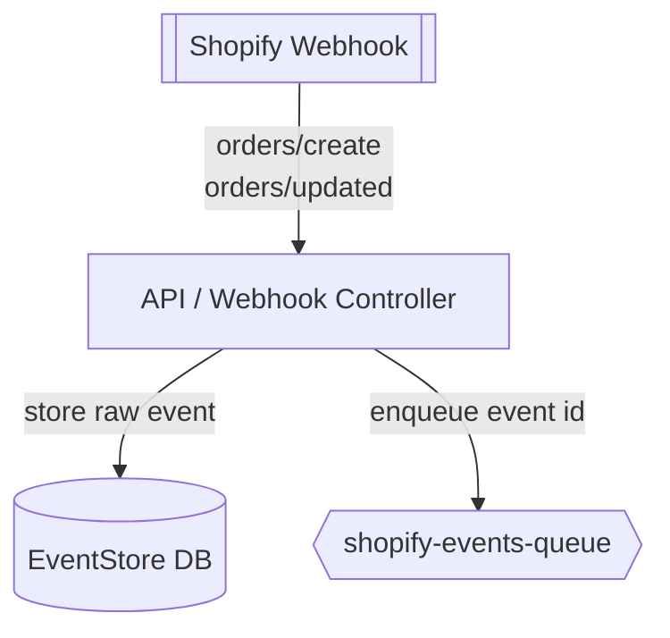

# Shopify Webhook → Ingestion Flow (High-Level)

```mermaid
flowchart TD

    Shopify[[Shopify Webhook]]
    Fincart[API / Webhook Controller]
    DB[(EventStore DB)]
    Queue{{shopify-events-queue}}

    Shopify -->|orders/create<br/>orders/updated| Fincart

    Fincart -->|store raw event| DB
    Fincart -->|enqueue event id| Queue
```
