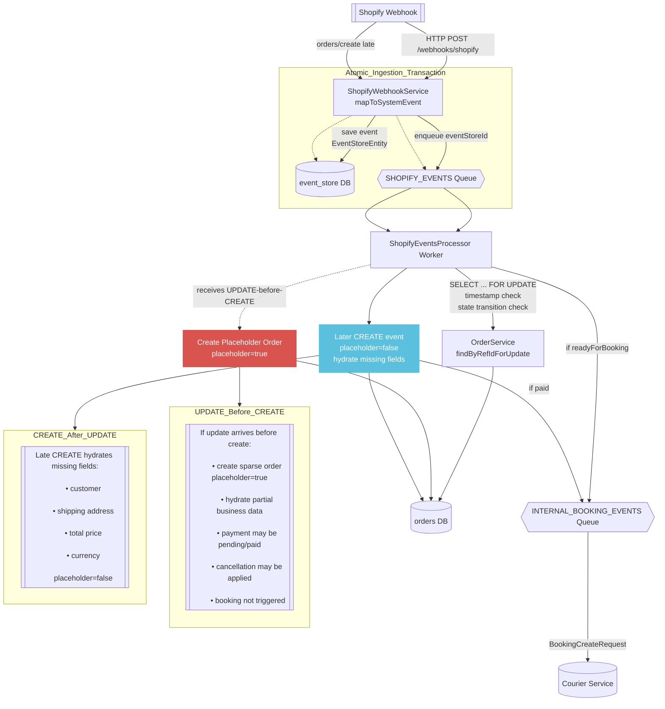

# Shopify Webhook -> DB[events] & Queue -> Worker -> DB[orders]

```mermaid
flowchart TD
    ShopifyWebhook[[Shopify Webhook]]
    IngestService[ShopifyWebhookService<br/>mapToSystemEvent]
    EventStore[(event_store DB)]
    EventsQueue{{SHOPIFY_EVENTS Queue}}
    Worker[ShopifyEventsProcessor Worker]
    OrderService[OrderService<br/>findByRefIdForUpdate]
    OrdersDB[(orders DB)]
    BookingQueue{{INTERNAL_BOOKING_EVENTS Queue}}
    CourierAPI[(Courier Service)]

    ShopifyWebhook -->|HTTP POST /webhooks/shopify| IngestService
    IngestService -->|save event<br/>EventStoreEntity| EventStore
    IngestService -->|enqueue eventStoreId| EventsQueue

    subgraph Atomic_Ingestion_Transaction
      IngestService -.-> EventStore
      IngestService -.-> EventsQueue
    end

    EventsQueue --> Worker

    Worker -->|SELECT ... FOR UPDATE<br/>timestamp check<br/>state transition check| OrderService
    OrderService --> OrdersDB

    Worker -->|if readyForBooking| BookingQueue
    BookingQueue -->|BookingCreateRequest| CourierAPI

    %% Out-of-order handling
    style Placeholder stroke:#d9534f,stroke-width:2px,color:#fff,fill:#d9534f
    Placeholder[Create Placeholder Order<br/>placeholder=true]

    Worker -. receives UPDATE-before-CREATE .-> Placeholder
    Placeholder --> OrdersDB

    subgraph UPDATE_Before_CREATE
      direction TB
      note1[[
        If update arrives before create:<br/>
        • create sparse order placeholder=true<br/>
        • hydrate partial business data<br/>
        • payment may be pending/paid<br/>
        • cancellation may be applied<br/>
        • booking not triggered
      ]]
    end

    Placeholder --> UPDATE_Before_CREATE

    %% Late CREATE
    style Hydrate stroke:#5bc0de,stroke-width:2px,fill:#5bc0de,color:#fff
    Hydrate[Later CREATE event<br/>placeholder=false<br/>hydrate missing fields]

    ShopifyWebhook -->|orders/create late| IngestService
    EventsQueue --> Worker
    Worker --> Hydrate
    Hydrate --> OrdersDB

    subgraph CREATE_After_UPDATE
      note2[[
        Late CREATE hydrates missing fields:<br/>
        • customer<br/>
        • shipping address<br/>
        • total price<br/>
        • currency<br/>
        placeholder=false
      ]]
    end

    Hydrate --> CREATE_After_UPDATE

    Hydrate -->|if paid| BookingQueue
```
